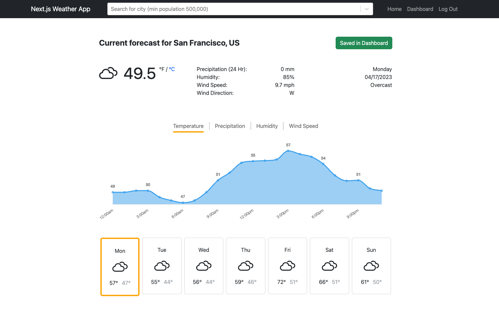

# Next.js Weather App



## Description

**Next.js Weather App** provides live weather conditions for any city in the world. It is a full-stack demo based on the TypeScript-focused [T3 web development stack](https://create.t3.gg/), which consists of the [Next.js](https://nextjs.org/) web framework and [tRPC](https://trpc.io/docs/), a typesafe alternative to traditional REST or GraphQL APIs. It has architectural elements in place (e.g. NextAuth.js, Prisma ORM, Zod schema validation) to help developers easily scale up its functionality. It provides hourly forecast data from the [Open-Meteo Free Weather API](https://open-meteo.com/en/docs) which uses weather models from multiple national weather providers and supports a wide variety of weather variables. Feel free to use or modify the codebase for your own project!

## File structure

- `src`
  - `assets` - This folder holds assets such as images
  - `backend` - This folder holds files used by the backend
    - `routers` - This folder holds router files used by the tRPC backend
    - `context.ts` - This file provides the tRPC context object
    - `trpc.ts` - This file initializes the tRPC backend
  - `components` - This folder holds different components that make up our frontend views
  - `db` - This folder holds files used to communicate with the database
  - `hooks` - This folder holds React hooks for use in functional components
  - `models` - This folder holds data models used by the backend
  - `pages` - This folder holds components organized by page level view
    - `api` - This folder holds files used by Next.js to handle api calls
      - `auth` - This folder holds files used to handle NextAuth api calls
      - `trpc` - This folder holds files used to handle tRPC api calls
    - `_app.tsx` - Entrypoint for Next.js app
  - `styles` - This folder holds stylesheets and fonts used by the frontend
  - `utils` - This folder holds files for utility functions
  - `viewModels` - This folder holds view models used by the frontend
- `public` - This folder holds static content used by the app
- `prisma` - This folder holds files used by Prisma ORM
- `.husky` - This folder holds files used by Husky.js
- `.env.sample` - Sample file containing environment variables used by the app
- `.eslintignore` - Directories to exclude from linting
- `.eslintrc.json` - Defines linting behaviors
- `.gitignore` - Directories to exclude from git tracking
- `.prettierignore` - Directories to exclude from Prettier.js formatting
- `.prettierrc.json` - Configuration file for Prettier.js
- `.auth.d.ts` - Type definitions used by NextAuth.js
- `.next.config.js` - Configuration file for Next.js
- `.next.d.ts` - Type definitions used by Next.js
- `package.json` - Defines npm behaviors and packages
- `package-lock.json` - Tracks dependency tree
- `.tsconfig.json` - Configuration file for TypeScript
- `README.md` - This file!

## Initial Setup

This demo was built using Node.js version 16. Please install a long-term support (LTS) version for best compatibility with other libraries.

- Node.js <https://nodejs.org/en/download/>

To verify that you have Node.js installed on your system, type the following command in your command line terminal (Terminal for Mac/Linux, CMD for Windows).

```console
node -v
```

### Environment Variables

Before you build or run the app, create a new files called `.env` at the project root. This file will be used by Next.js to expose environment variables to your app at runtime.

You will need to enter values for the following environment variables (refer to `.env.sample` for example values):

`DATABASE_URL`: URL of the database that Prisma connects to. See the [documentation](https://www.prisma.io/docs/reference/database-reference/connection-urls) for info about all database options.

`PORT`: Port where the app will run

`NEXTAUTH_URL`: The canonical URL of your production site. This variable does not need to be set when deploying on certain web platforms such as [Vercel](https://vercel.com/docs/concepts/projects/environment-variables#system-environment-variables).

`NEXTAUTH_SECRET`: Used to encrypt the NextAuth JWT. This is the default value for the `secret` option in NextAuth and Middleware.

`NEXT_PUBLIC_GEO_API_URL`: Base URL for the [GeoDB Cities API](https://rapidapi.com/wirefreethought/api/geodb-cities) host. You need to create a Rapid API key to access this API's endpoints.

`NEXT_PUBLIC_RAPID_API_KEY`: API key required to access any Rapid API host

`NEXT_PUBLIC_RAPID_API_HOST`: Base URL for calls to any Rapid API host

`NEXT_PUBLIC_APP_DEFAULT_LOCATION`: Default location used by the app. This must be formtted as `[city.name], [city.countryCode]` based on response data of type `city` from GeoDB Cities API e.g. "San Francisco, US"
